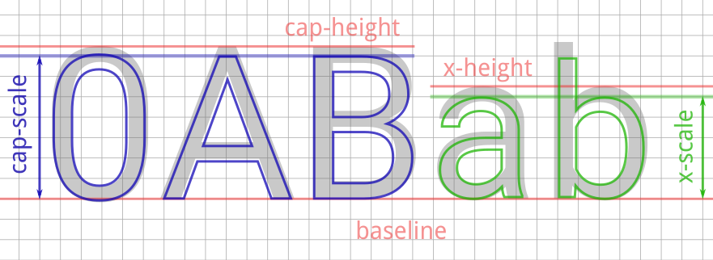
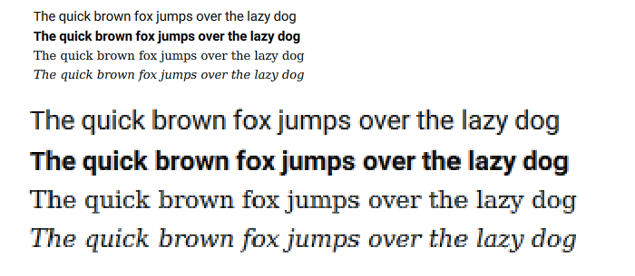

# WebGL Font Rendering

Crisp font rendering on the GPU with glyph hinting and subpixel antialiasing. No external dependencies, very small:  
https://bundlephobia.com/package/webgl-fonts@1.2.2

## Usage

```bash
npm install webgl-fonts
```

Place your fonts in the `public/fonts` or `static/fonts` directory depending on your setup. Then use `loadFont` function to load the font and `createRenderer` to create a renderer.

```javascript
import { createRenderer, loadFont } from 'webgl-fonts';

// create a WebGL2 context
const canvas = document.getElementById('canvas');
const gl = canvas.getContext('webgl2');

// thiis will load json and png files from 
// public/fonts/roboto.json and public/fonts/roboto.png
const font = await loadFont(gl, 'roboto');
const renderer = createRenderer(gl);

// render loop
function loop() {
  renderer.render({
    font,
    fontSize: 32,
    text: 'Hello, world!',
    translateX: 0,
    translateY: 0,
    fontHinting: true,
    subpixel: true,
    fontColor: [1, 1, 1, 1],
    backgroundColor: [0, 0, 0, 1],
  });
  requestAnimationFrame(loop);
}
loop();

```

## Demo

The demo uses [signed distance field method](http://www.valvesoftware.com/publications/2007/SIGGRAPH2007_AlphaTestedMagnification.pdf) for glyph rendering.

[Click here to see the demo](https://webgl-fonts.vercel.app/) (requires WebGL).

Font atlas generation tool is [here](https://github.com/astiopin/sdf_atlas).

## Hinting

The idea is pretty simple. First we're placing the text baseline exactly at the pixel boundary. Next we're using two different methods to place the glyphs. Lowcase characters are scaled in a such way that the [x-height](https://en.wikipedia.org/wiki/X-height) spans a whole number of pixels. All other characters are scaled to fit the [cap height](https://en.wikipedia.org/wiki/Cap_height) to the pixel boundary.



At the rasterisation stage we're modifying the antialiazing routine so that the antialiazed edge distance depends on a stroke direction, which makes horizontal strokes appear sharper than the vertical ones.


